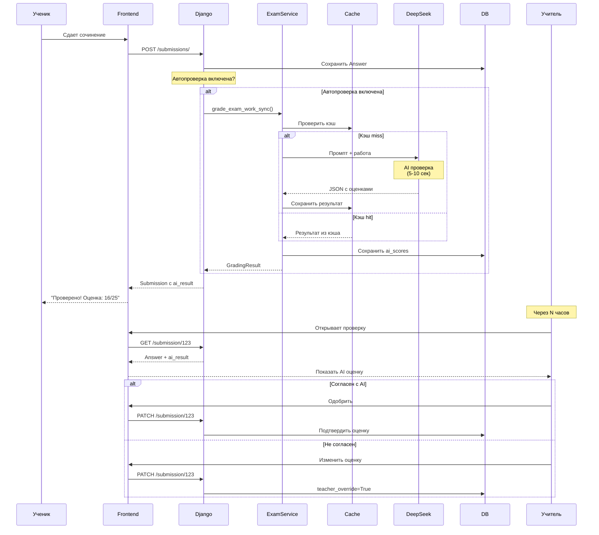
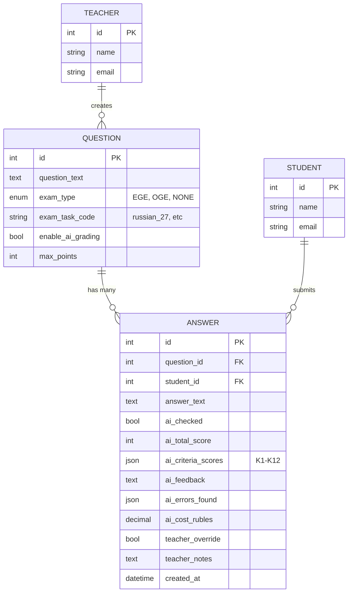
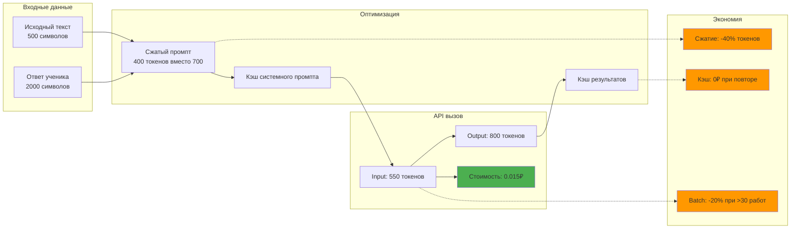
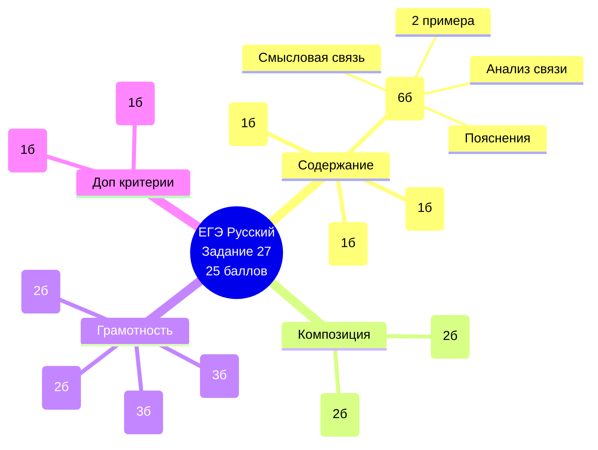
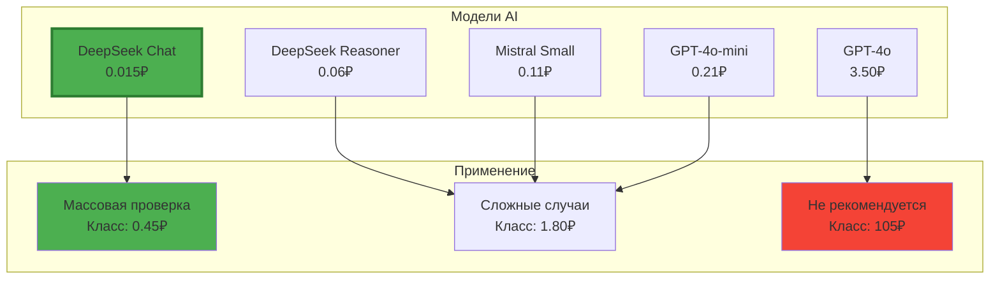
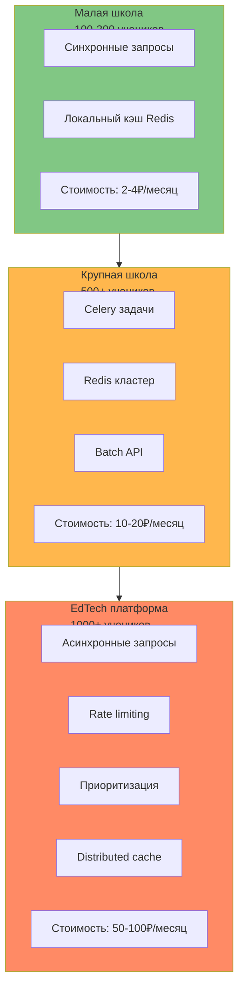
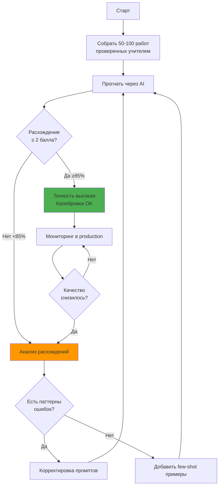
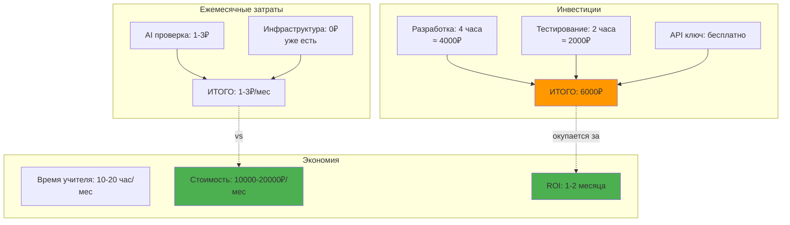
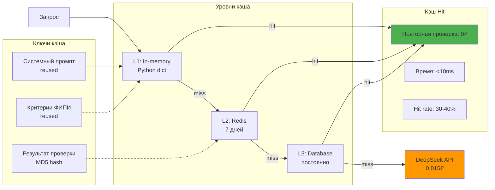

# AI Проверка ЕГЭ/ОГЭ - Архитектурные диаграммы

## 1. Общая архитектура системы

```mermaid
flowchart TB
    subgraph Frontend["Frontend (React)"]
        UI[Интерфейс учителя]
        AIButton[Кнопка "Проверить с AI"]
        AIResult[Компонент результата AI]
    end
    
    subgraph Backend["Django Backend"]
        API[HomeworkSubmissionViewSet]
        ExamService[ExamAIGradingService]
        BaseService[AIGradingService]
        Examples[ai_grading_examples.py<br/>Критерии ФИПИ]
        Cache[Django Cache<br/>Redis]
    end
    
    subgraph External["Внешние сервисы"]
        DeepSeek[DeepSeek API<br/>deepseek-chat]
    end
    
    subgraph Database["База данных"]
        Question[Question<br/>exam_type, exam_task_code]
        Answer[Answer<br/>ai_checked, ai_scores]
    end
    
    UI --> AIButton
    AIButton -->|POST /check-with-ai/| API
    API --> ExamService
    ExamService --> Examples
    ExamService --> BaseService
    ExamService --> Cache
    BaseService -->|HTTP Request| DeepSeek
    DeepSeek -->|JSON Response| BaseService
    BaseService --> ExamService
    ExamService --> API
    API --> AIResult
    API --> Answer
    API --> Question
    
    style DeepSeek fill:#4CAF50
    style Cache fill:#FF9800
    style Examples fill:#2196F3
```

## 2. Workflow проверки работы



## 3. Структура данных (модели БД)



## 4. Процесс экономии токенов



## 5. Критерии ФИПИ для ЕГЭ Русский язык



## 6. Градация стоимости по моделям



## 7. Масштабирование системы



## 8. Workflow калибровки AI



## 9. Экономика проекта (ROI)



## 10. Архитектура кэширования



---

## Легенда

- 🟢 Зеленый: Оптимально, рекомендуется
- 🟠 Оранжевый: Компромисс, для специальных случаев
- 🔴 Красный: Дорого, не рекомендуется

## Использование диаграмм

Все диаграммы созданы в формате Mermaid и могут быть:
- Встроены в Markdown (GitHub, GitLab поддерживают нативно)
- Экспортированы в PNG/SVG через mermaid.live
- Использованы в презентациях и документации

## Ссылки на документацию

- **Детальное описание**: См. AI_GRADING_GUIDE.md
- **Интеграция**: См. EGE_OGE_AI_INTEGRATION_GUIDE.md
- **Быстрый старт**: См. AI_GRADING_QUICKSTART.md
